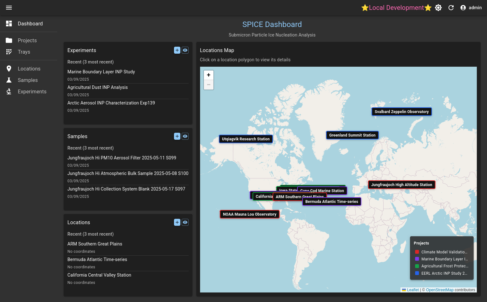
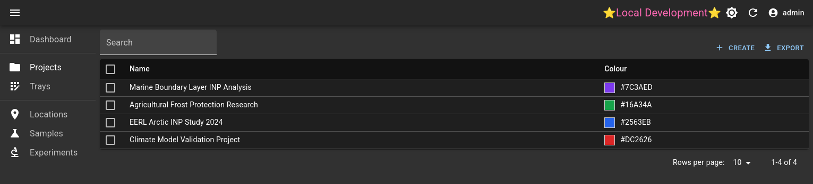
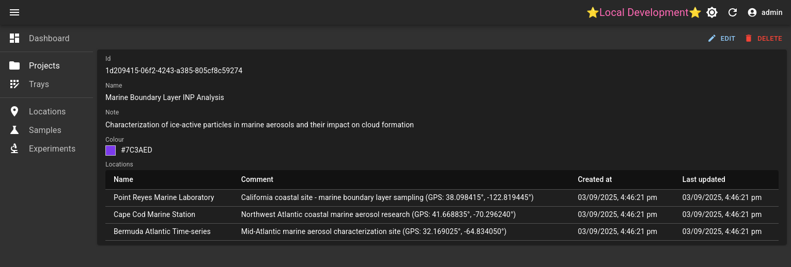
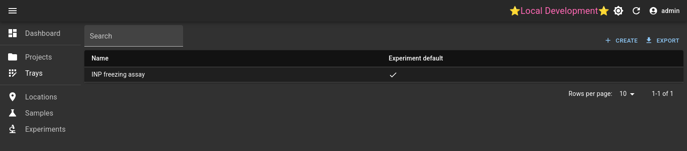
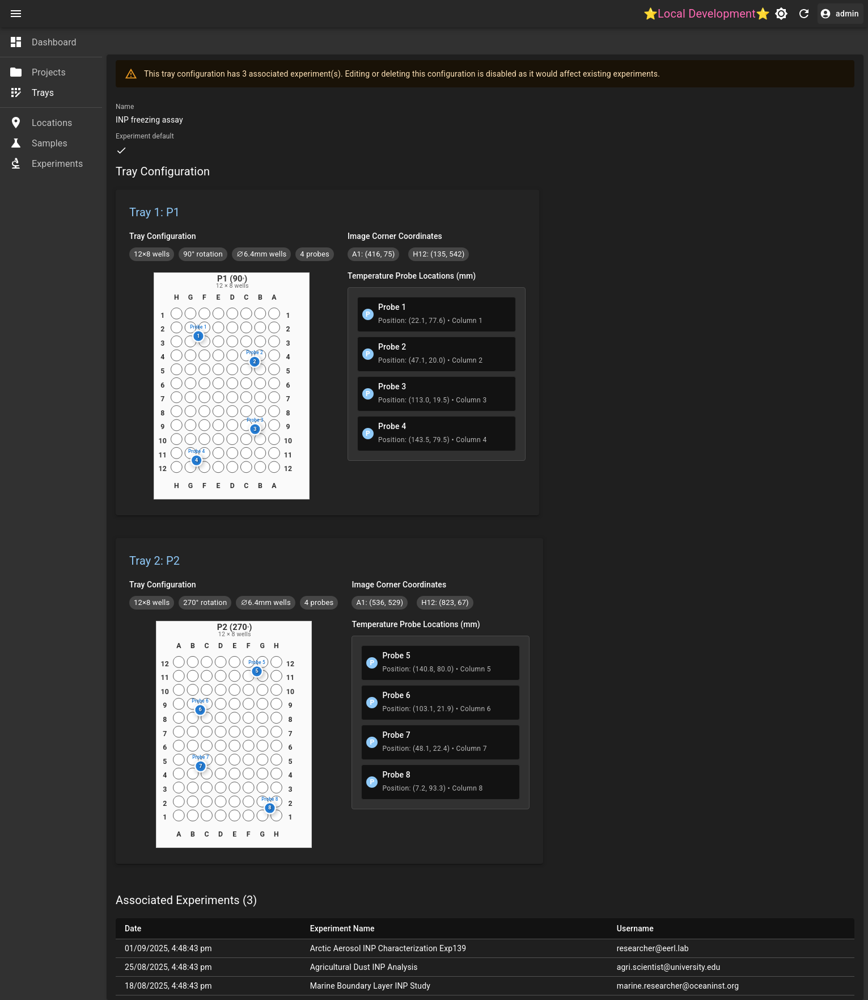
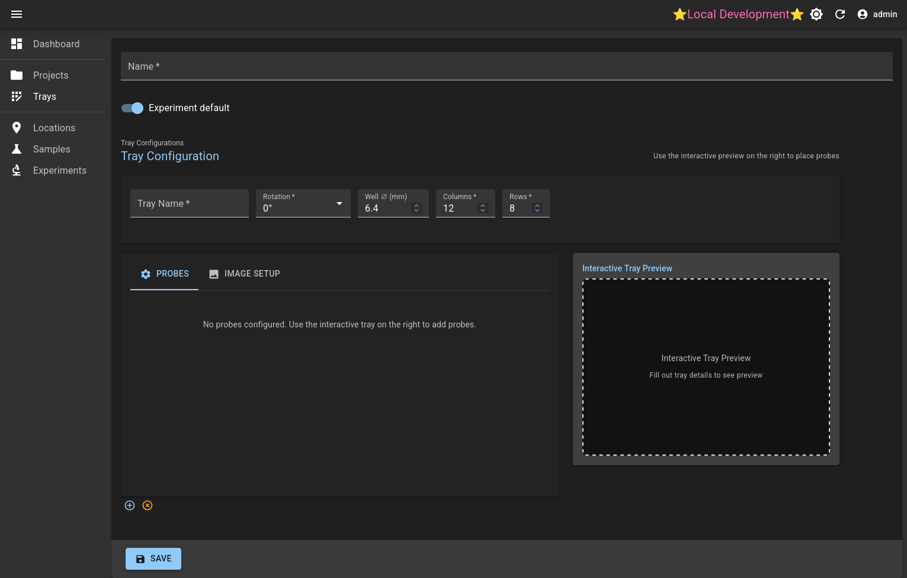
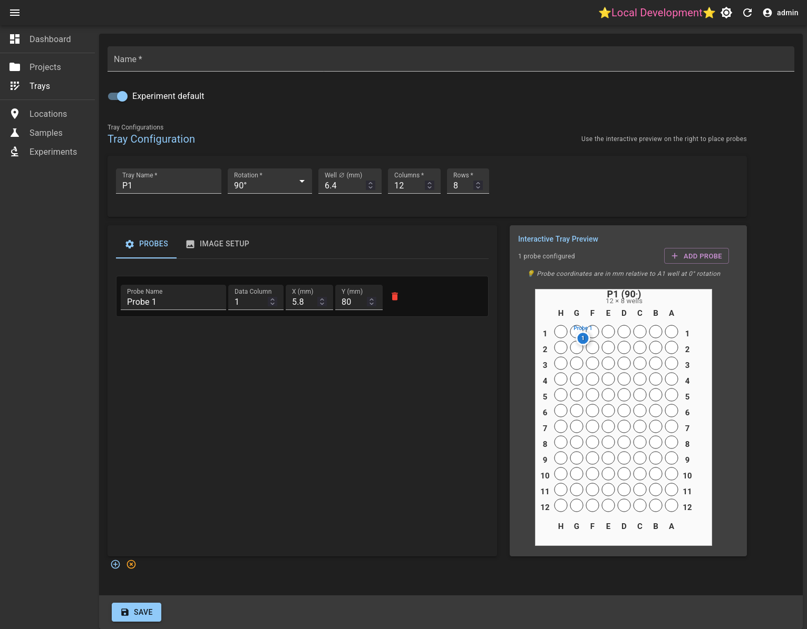
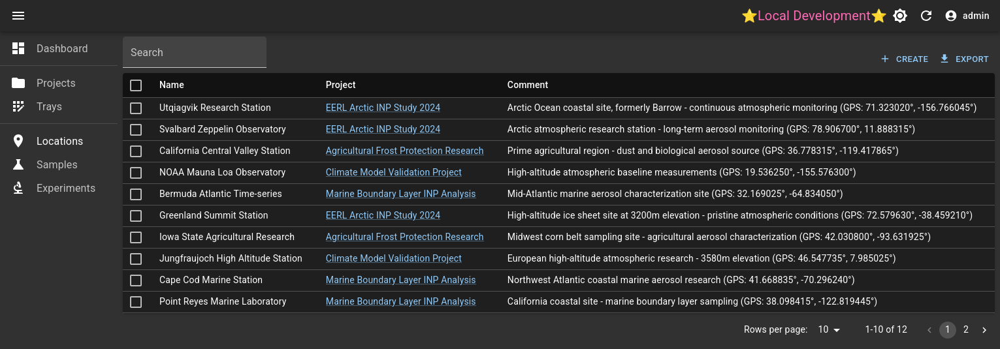

# SPICE

The SPICE project manages the data produced from ice nucleating particle
experiments. It manages the samples, locations, experiments, and their results.

There are three components to the project:

1. The [API](https://github.com/EERL-EPFL/spice-api)
   - Abstracts the database and file storage,
   - provides an authentication layer,
   - Consolidates logic for data summaries and results.
2. The [UI](https://github.com/EERL-EPFL/spice-ui) _<-- you are here_
   - To visualise and interact with the API.
3. The [Python client](https://github.com/EERL-EPFL/spice-client)
   - A client interface to interact with the database from Python.
   - All methods available in the UI can be programatically accessed through the API.
4. The [freezing-droplets library](https://github.com/EERL-EPFL/freezing-droplets)
   - The SPICE project expects results to be processed with the [freezing-droplets library](https://github.com/EERL-EPFL/freezing-droplets).
   - Although many of the database components in SPICE are agnostic to the results, the results
     processing pipeline is based on its exported outputs and its employed methodology.

# Installation

## Dependencies

The following external dependencies are required for this project

- PostgreSQL with PostGIS extensions
- S3, or S3 compatible storage
- Keycloak for authentication

For development, these are mocked locally in the docker-compose.yaml.

## Development

Inside this repository, a `docker-compose.yaml` provides the necessary services
for a local deployment, however, each individual repository must be first
cloned into their respective directory:

```bash
# Create folder and enter
mkdir spice && cd spice

# Clone this UI and the API
git clone https://github.com/EERL-EPFL/spice-ui.git
git clone https://github.com/EERL-EPFL/spice-api.git

# Enter the UI folder and start the deployment with docker compose
cd spice-ui

# Sync the UI with its dependencies
yarn
docker compose up --build
```

This will start a local Keycloak, MinIO (S3), and PostGIS instance, alongside
the UI and API.

By default, the traefik reverse proxy will listen on port `88`, at `spice`.
Also there is the local development keycloak that needs a separate host, it is
exposed on port 8888, and the development setup requires it to be at spice-keycloak,
Therefore, you should edit your `/etc/hosts` file to include the following lines:

```
127.0.0.1 spice
127.0.0.1 spice-keycloak
```

Then, point your browser to `http://spice:88`. You will be able to login as
an admin user with:

- user: admin
- pass: admin

**Note: Do not use the docker-compose.yaml or keycloak-realm-dev.json for production**. They
may, however, be used to understand the deployment structure. Follow the production guidelines below.

### Seed database

In the `spice-api` repository, there is a database seed application to fill
the database with pseudo data. It can be run with:

```bash
cargo run --bin seed_database -- --url http://spice:88/`
```

It will prompt for username and password. Use in this case,
the ones defined above for admin. To run this script you will
need [Rust and cargo](https://doc.rust-lang.org/cargo/getting-started/installation.html)
installed.

## Production

### Keycloak

A realm must be setup according to keycloak, with admin users assigned to
the **spice-admin** role.

## Usage

### API

The API documentation is served by the API at runtime, providing an
openapi.json (or yaml). It can be found at:

`https://<root-url>/api/docs`

For example, [http://spice:88/api/docs](http://spice:88/api/docs) if following
the development setup.

### UI

_Note: The data displayed in the UI is generated from the `seed_database` script
detailed in the development setup, is curated for development purposes, and does
not represent reality._

The UI application consists of six major components:

- Dashboard
- Projects
- Trays
  - Tray configurations
  - Probe locations
- Locations
- Samples
  - Treatments
- Experiments
  - Assets
  - Results
  - Regions

#### Dashboard



The dashboard gives an overview of the last three experiment, sample, and location
records, with a map overview of all locations.

The map shows all of the locations coloured by project. They can be disabled by
interacting with the project name on the legend. Each geographical location boundary
is the convex hull around all its samples that are associated with a coordinate.

#### Projects



A project contains many locations, and is given a colour, as to distinguish it
from other projects in the UI.

An individual project will display all of the associated locations within it.



#### Trays



The application considers a tray within the definition of a
[standard microplate](https://en.wikipedia.org/wiki/Microplate), therefore,
the tray configuration component defines the size, arrangement, and rotation of
a microplate trays inside each experiment.

The temperature probe locations are defined in each tray, as well as the location
of wells in image coordinates.

Once a tray configuration has been added to an experiment, it can no longer
be modified. Should the tray arrangement of probe locations change, a new tray
configuration must be created and associated with subsequent experiments.



Associated experiments are shown for each tray configuration.

##### Creating a tray configuration



In the creation of a tray configuration, one must first define the:

1. Name of the tray. This value must match the value that represents
   each tray in the results.
2. The rotation of its arrangement in the experiment, in clockwise direction. A
   rotation of 0° corresponds with a standard microplate where well A1 is positioned
   at the top left, and, assuming an 8x12 layout, H12 at the bottom right.
3. The well diameter in millimeters.
4. The quantity of columns and rows. The UI will render rows as characters and
   columns as numbers (for example, A2 for row 1, column 2).

A visualisation will appear with the tray in this configuration, to add probes,
click the `+ ADD PROBE` button above the tray, and selecting the location on the tray
where this specific



After creating the first tray, subsequent trays can be added, and repeated with the add tray
button at the bottom. Probes are auto


#### Locations



#### Samples


#### Experiments


