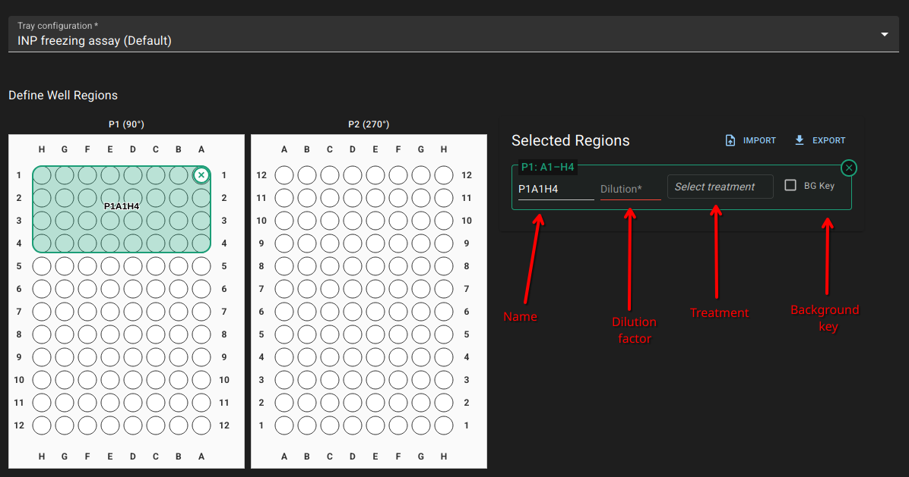
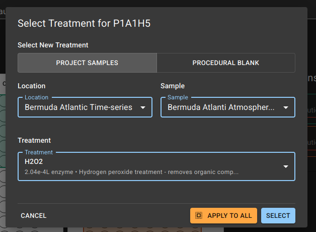
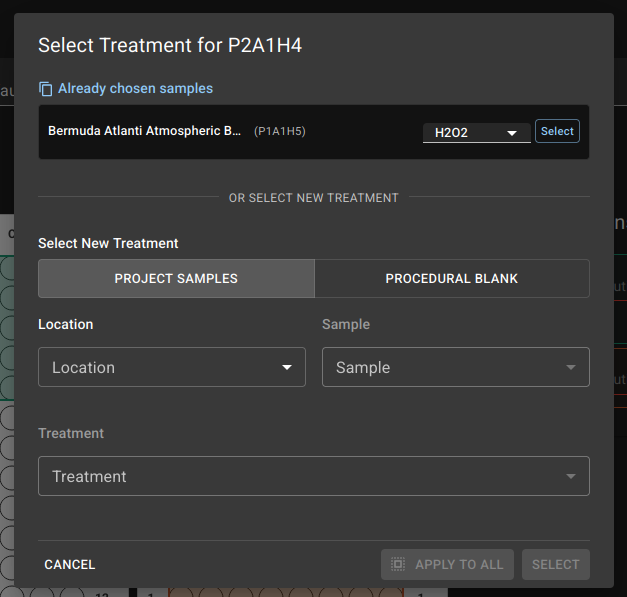

# SPICE

The SPICE project manages the data produced from ice nucleating particle
experiments. It manages the samples, locations, experiments, and their results.

There are four components to the project:

1. The [API](https://github.com/EERL-EPFL/spice-api)
   - Abstracts the database and file storage,
   - provides an authentication layer,
   - Consolidates logic for data summaries and results.
2. The [UI](https://github.com/EERL-EPFL/spice-ui) _<-- you are here_
   - To visualise and interact with the API.
3. The [Python client](https://github.com/EERL-EPFL/spice-client)
   - A client interface to interact with the database from Python.
   - All methods available in the UI can be programatically accessed through
     the API.
4. The [freezing-droplets library](https://github.com/EERL-EPFL/freezing-droplets)
   - The SPICE project expects results to be processed with the
     [freezing-droplets
     library](https://github.com/EERL-EPFL/freezing-droplets).
   - Although many of the database components in SPICE are agnostic to the
     results, the results processing pipeline is based on its exported outputs
     and its employed methodology.

## Table of Contents

- [Installation](#installation)
  - [Dependencies](#dependencies)
  - [Development](#development)
  - [Production](#production)
- [Usage](#usage)
  - [API](#api)
  - [UI](#ui)
    - [Dashboard](#dashboard)
    - [Projects](#projects)
    - [Trays](#trays)
    - [Locations](#locations)
    - [Samples](#samples)
    - [Experiments and results](#experiments)

# Installation

## Dependencies

The following external dependencies are required for this project:

- PostgreSQL with PostGIS extensions
- S3, or S3 compatible storage
- Keycloak for authentication

For development, these are mocked locally in the docker-compose.yaml.

## Development

Inside this repository, a `docker-compose.yaml` provides the necessary services
for a local deployment, however, each individual repository must be first
cloned into their respective directory:

```bash
# Create folder and enter
mkdir spice && cd spice

# Clone this UI and the API
git clone https://github.com/EERL-EPFL/spice-ui.git
git clone https://github.com/EERL-EPFL/spice-api.git

# Enter the UI folder and start the deployment with docker compose
cd spice-ui

# Sync the UI with its dependencies
yarn
docker compose up --build
```

This will start a local Keycloak, MinIO (S3), and PostGIS instance, alongside
the UI and API.

By default, the traefik reverse proxy will listen on port `88`, at `spice`.
Also there is the local development keycloak that needs a separate host, it is
exposed on port 8888, and the development setup requires it to be at
spice-keycloak. Therefore, you should edit your `/etc/hosts` file to include
the following lines:

```
127.0.0.1 spice
127.0.0.1 spice-keycloak
```

Then, point your browser to `http://spice:88`. You will be able to login as
an admin user with:

- user: admin
- pass: admin

**Note: Do not use the docker-compose.yaml or keycloak-realm-dev.json for
production**. They may, however, be used to understand the deployment
structure. Follow the production guidelines below.

### Seed database

In the `spice-api` repository, there is a database seed application to fill
the database with pseudo data. It can be run with:

```bash
cargo run --bin seed_database -- --url http://spice:88/
```

It will prompt for username and password. Use, in this case, the ones defined
above for admin. To run this script you will need [Rust and
cargo](https://doc.rust-lang.org/cargo/getting-started/installation.html)
installed.

## Production

### Keycloak

A realm must be set up according to Keycloak, with admin users assigned to
the **spice-admin** role.

## Usage

### API

The API documentation is served by the API at runtime, providing an
openapi.json (or YAML). It can be found at:

`https://<root-url>/api/docs`

For example, [http://spice:88/api/docs](http://spice:88/api/docs) if following
the development setup.

### UI

_Note: The data displayed in the UI is generated from the `seed_database`
script detailed in the development setup, is curated for development purposes,
and does not represent reality._

The UI application consists of six major components:

- Dashboard
- Projects
- Trays
  - Tray configurations
  - Probe locations
- Locations
- Samples
  - Treatments
- Experiments
  - Assets
  - Results
  - Regions

#### Dashboard


The dashboard gives an overview of the last three experiment, sample, and
location records, with a map overview of all locations.

The map shows all of the locations coloured by project. They can be disabled by
interacting with the project name on the legend. Each geographical location
boundary is the convex hull around all its samples that are associated with a
coordinate.

#### Projects


A project contains many locations, and is given a colour, as to distinguish it
from other projects in the UI.

An individual project will display all of the associated locations within it.


#### Trays


The application considers a tray within the definition of a [standard
microplate](https://en.wikipedia.org/wiki/Microplate), therefore, the tray
configuration component defines the size, arrangement, and rotation of a
microplate tray inside each experiment.

The temperature probe locations are defined in each tray, as well as the
location of wells in image coordinates.

Once a tray configuration has been added to an experiment, it can no longer
be modified. Should the tray arrangement or probe locations change, a new tray
configuration must be created and associated with subsequent experiments.


Associated experiments are shown for each tray configuration.

##### Creating a tray configuration


In the creation of a tray configuration, one must first define the:

1. Name of the tray. This value must match the value that represents
   each tray in the results.
2. The rotation of its arrangement in the experiment, in clockwise direction. A
   rotation of 0° corresponds with a standard microplate where well A1 is
   positioned at the top left, and, assuming an 8x12 layout, H12 at the bottom
   right.
3. The well diameter in millimeters.
4. The quantity of columns and rows. The UI will render rows as characters and
   columns as numbers (for example, A2 for row 1, column 2).

A visualisation will appear with the tray in this configuration. To add probes,
click the `+ ADD PROBE` button above the tray, and select the location on
the tray where this specific probe should be placed.


###### Probes

Probes are numerically incremented based on the entire configuration, such that
if tray 1 has four probes, the next probe added in tray 2 will be probe 5.
There are four fields related to each probe:


1. **Probe name**: This is an arbitrary name to identify the probe and can be
   anything to identify it.
2. **Data column**: This is the numeric order of the probe in the column of the
   result data. This will be used to link result data to the probes in an
   experiment. For example, in these results `Channel 1` and `Channel 2` would
   be given `Data Column` values `1` and `2` respectively:

   

3. **X position/Y position**: The X and Y coordinates of the probe in
   millimeters, relative to the first well and disregarding rotation (A1). The
   probes can also be moved by clicking and dragging them to set new coordinate
   values.

###### Image coordinates

The well locations are defined in image coordinates, with the origin (0,0) at
the top left of the image. Adding an image from the camera, click the location
of the A1 well, and then subsequently the final well (H12 in an 8x12 layout).
The application will then interpolate the locations of all wells in between.


After creating the first tray, subsequent trays can be added, and repeated with
the add tray button at the bottom.

#### Locations


Locations represent geographical sampling sites where samples are collected.
Each location is associated with a specific project and contains a name and
comment for context.

Once a sample (or experiment associated with the sample) is created and linked
to a location. Their records are available from the location details page.

The map is generated by using the geographic coordinates of all samples
associated with the location, and drawing the convex hull around them.


#### Samples


Samples represent individual specimens collected from specific locations. Each
sample contains detailed metadata about collection conditions and subsequent
laboratory processing.

A sample is broken up into three types:

- Bulk samples: These are the original samples collected from the field.
- Filter samples
- Blank: Representing samples that are used as background controls.
  There is minimal metadata associated with these samples, and they are not
  explicitly linked to a location or project. However, they still require,
  like others, treatment information (see below).

##### Treatments

A sample is associated with an experiment by its treatment. Therefore, each
sample must have at least one treatment record. When creating one, by
default, a `None` treatment is added.

The available treatment types are:

- **None**
- **Heat**
- **H2O2**

A sample can have many treatments, and the dilution of these treatments in an
experiment is managed in the `Experiment` component (see below).

#### Experiments

Experiments represent individual ice nucleation tests. Each experiment can
process multiple samples simultaneously across configured tray layouts.

##### Creating an experiment


When creating an experiment, the following fields are required:

- **Name**: An arbitrary name to identify the experiment.
- **Date**: The date when the experiment was conducted.
- **Tray configuration**: The tray configuration that defines the arrangement
  of wells and probes for this experiment. Set up in the `Trays` component
  above.

Otherwise, the following optional fields can be filled:

- **Temperature ramp**: The rate at which the temperature decreases during the
  experiment, in °C/min.
- **Temperature start**: The starting temperature of the experiment, in °C.
- **Temperature end**: The ending temperature of the experiment, in °C.
- **Username**: An optional field for identifying the conductor of the
  experiment. It does not necessarily mean a person; perhaps it's an
  auto-generated ID, can be empty or arbitrary.
- **Remarks**: Any additional notes or comments about the experiment.
- **Is calibration**: A boolean flag to indicate if the experiment is a
  calibration run.

After selecting the tray configuration, the UI will display this corresponding
configuration. By default, the tray configuration that is set as the default in
the `Trays` component will already be pre-selected.



According to the experiment setup, draw the regions associated with the tray
wells by clicking and dragging the mouse over the tray image. The region will
show up to the right with the following fields:

- **Name**: By default this is a composite of
  `<TrayName>` `<WellIDStart>` `<WellIDEnd>`, for example, `P1A1H4`, but can be
  anything that distinguishes the group of wells, **it must be unique within
  the experiment**.
- **Dilution factor**: The dilution factor applied to the samples in this
  region.
- **Treatment**: A selector to choose the sample and its treatment to apply to
  this region. Keep in mind that blanks are selected here as well.
  The selector is further described below.
- **Background key**: An optional checkbox to denote that the sample is a
  background control.

###### Treatment selector

After clicking the `Select treatment` button on the region a small window will
appear. If selecting a sample with a treatment, select first the `location`,
then the `sample` related to it. All of the treatments will be shown beneath.
Select one and then click either `APPLY TO ALL` or `SELECT`, which will set the
treatment to all regions in the experiment, or just the one selected.



After already selecting one treatment, pressing the `Select treatment` button
again will show a list of all samples that have previously been selected in
this experiment. Here you can change the treatment and add, again, to all
regions, or just the one selected.

Finally, the `BLANK` tab will show all of the blanks
available. Unlike `Project samples`, they do not carry location information;
however, the selection of treatment is the same.



**Note**: If you have a regions.yaml from the freezing-droplets library, you
can import it with the `IMPORT` button. Subsequently, you can export the
regions in this format with the `EXPORT` button in this page, and also in the
experiment details page.

##### Viewing an experiment

The default view after creation is similar to the creation view, however, now
the experiment assets can be uploaded. This assumes that the results have
already been processed with the `freezing-droplets` library.


Clicking on the `ASSETS` tab will allow uploading of the project assets. These
may be anything related to the experiment, including metadata, raw camera
images, temperature recordings, and analysis outputs.

The server will automatically detect the file types, and if a `merged.xlsx`
file is uploaded, will consider it the output results file, and parse it
accordingly. It may take some time to process the results file (~20 seconds).

The files can be filtered by type and purpose with the dropdowns. If
the file is an image, it can be previewed with the icon. All files can be
downloaded and deleted.


##### Results

If results have been processed, the experiment display will be slightly
different, with each well coloured according to the time it took to freeze.


Clicking on a well will display the sample (if assigned), its treatment, and
the freezing time. The temperatures of all probes will show at the time of
freezing (the numeric value inside the icon corresponds to the data column),
and the image at that point in time is able to be displayed with the view icon.


As the results have been populated for these regions, it is now possible to
view consolidated results per sample by going to the respective sample page
(we can click the link directly from this well view).

##### Results (In sample view)

After going to the sample we were just viewing, the sample display now shows
the associated treatments, the amount of wells it has been assigned to, the
experiments it belongs in, and a summary of its results per dilution (mean
freezing temperature, and median freezing time).


## Attribution

This project was developed by [Evan Thomas](https://github.com/evanjt) for the
[Environmental Engineering Research Laboratory (EERL)](https://eerl.epfl.ch/)
at EPFL.
